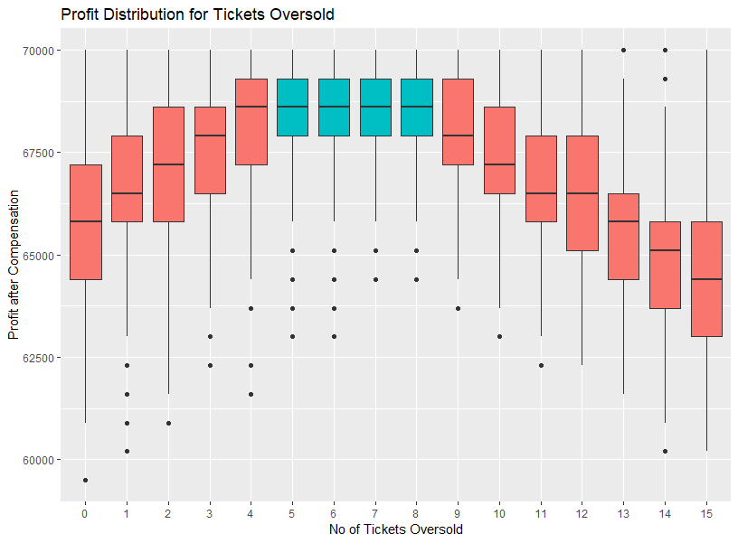

Simulating Airline Overbooking
================

I have just read an interesting
[article](https://www.cbc.ca/news/business/airline-passengers-bumping-overbooking-united-1.4065603)
about how flights are overbooked to maximize profit. Airlines have to
maximize profit when striking the balance between oversold tickets and
compensation to passengers who may have to give up seats due to
overbooking. To find the optimal number of oversold tickets, I have
written a set of R code to simulate different scenarios.

## Scenario

Given that a flight got maximum 100 seats and on average 94% of
passengers would show up, an airline would lose revenue if they only
accept 100 reservations, so naturally airlines would oversell tickets to
make up with the possible no-show passengers. But if more than 100
passengers turn up, there won’t enough seats and airlines have to
compensate passengers who have to give up their seats.

To maximize profit, airlines have to find the optimal number of oversold
tickets which strike balance between the revenue from oversold tickets
and potential loss from compensation.

## Solution using simulation in R

Let’s say tickets are sold at $700 per seat, and the compensation cost
is $1,400 per passenger who has to give up the seat because of
overbooking. And the plane only has 100 seats.

``` r
# capaciity of flight
seat_cap <- 100


# prob of showing up
prob_showup <- 0.94


# revenue per customer
revenue_per_seat <- 700


# compensation cost per oversold tickets
comp_per_seat <- revenue_per_seat * 2
```

With X number of tickets sold, we can write a function to generate a
list of passengers who may / may not show up given the 94% show-up rate.

``` r
# function of counting show up customers
generate.showup <- function(oversold, prob_showup) {
  
  # generate list of showup
  showup <- 
    sample(c(TRUE, FALSE),
         seat_cap + oversold,
         replace = TRUE,
         prob = c(prob_showup, 1-prob_showup))
  
  # count number of show up
  sum(showup)
  
}
```

Then for each ticket oversold, we can write another function to simulate
the total profit an airline makes for each flight (i.e. revenue made -
compensation cost). The function will automatically run 1,000 times to
find the revenue distribution for each scenario. By charting the tickets
oversold against profit, the optimal number of oversold tickets can be
found.

``` r
# build the data frame for capturing the result
result <- data.frame(
  Oversold = NA,
  Profit = NA
)


# max of tickets oversold
oversold_max <- 15


# no of simulation
sim <- 1000
 
 
# simulate the profit by running each scenario for 1000 times
for (oversold in 0:oversold_max) {
  
  for (i in 1:sim) {
    
    # random generate number of showing up
    showup_rand <- generate.showup(oversold, prob_showup)
    
    # revenue
    total_revenue = showup_rand * revenue_per_seat
    
    
    # compensation cost if more than cap are showing up
    comp_total <- ifelse(showup_rand >= seat_cap,
                         (showup_rand - seat_cap) * comp_per_seat,
                         0)
    
    # profit
    profit <- total_revenue - comp_total
    
    
    #add to result
    result <<- rbind(result, c(oversold, profit))
    
  }
}
```

Then plot a boxplot diagram to observe the revenue distribution for each
oversold ticket based on minimum, first quartile, median, third quartile
and maximum. You can see the <b>profit is maximized when 5 to 8 tickets
are oversold</b>. You can also adjust the parameters freely in the R
code for different flight size, ticket price and compensation cost.



All these (15 scenarios x 1,000 simulation) can be run in just 10
seconds\! You can appreciate how handy Monte Carlo simulation can be.

## R code

Link: <https://github.com/Lavinialau/Airline-Overbooking/tree/master/R>

## License

Developed by Lavinia Lau (Mar 2019)
